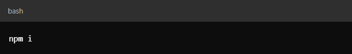

# Step-by-Step Guide to Contributing to an Open Source Project on GitHub

1. Search for a Project: You can search on GitHub for projects using Next.js and TypeScript by using the query: nextjs typescript language:TypeScript. If you're looking for a specific type of project, you can refine your search, for example: nextjs typescript e-commerce language:TypeScript. Once you find a project you're interested in, select it.

2. Fork the Repository: Click the Fork button at the top right of the repository page to create a copy of the repository in your own GitHub account.

3. Clone the Forked Repository: In your forked repository, click the Code button and copy the HTTPS link.

4, Clone the Project Locally: Create a folder to hold the cloned project. Open that folder in your terminal, then run the following command (replace HTTPS-Link with the actual link you copied):

5. Install Dependencies: To ensure everything works, navigate to the project directory in your terminal and run:

